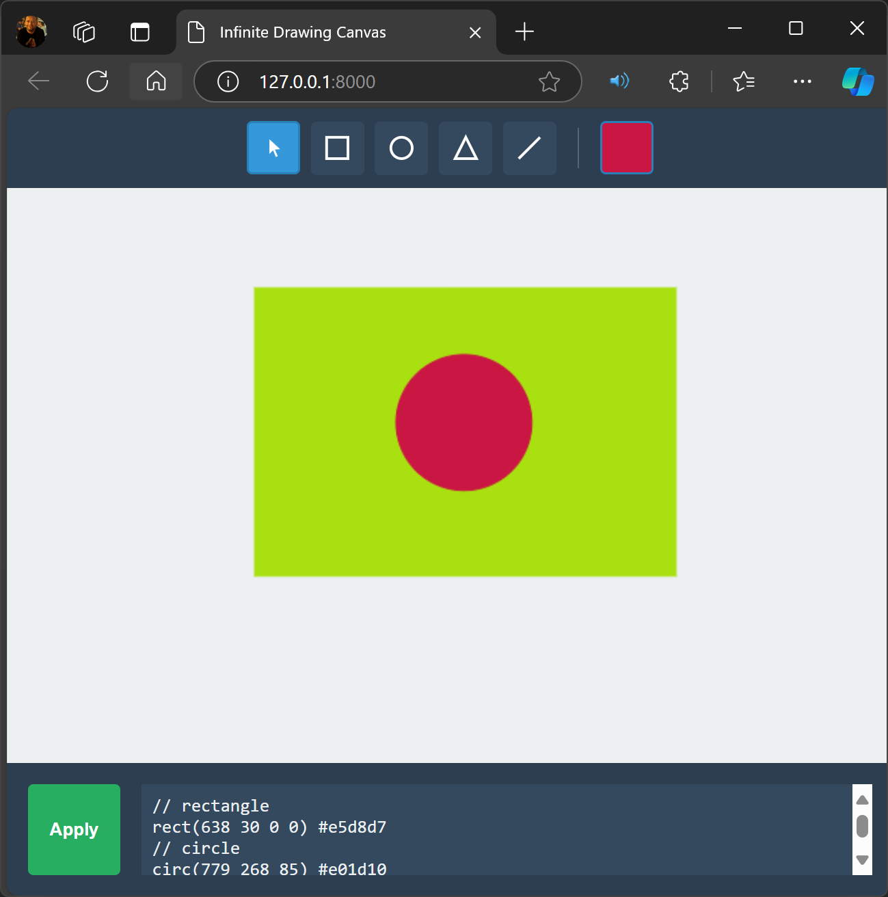

# PyDraw

A simple web-based drawing application using Python/FastAPI and JavaScript.

Designed by João Pinto
Coded by Claude - Sonnet AI

## Features

- **Real-time Drawing**: Utilize the HTML5 Canvas for dynamic and responsive drawing experiences.
- **Multiple Drawing Tools**:
    - **Select Tool**: Select, move, rotate, and resize shapes.
    - **Shape Tools**: Draw rectangles, circles, triangles, and lines with ease.
- **Layer Management**:
    - **Bring to Front / Send to Back**: Organize shapes using context menu options or keyboard shortcuts (`Ctrl + ]` to bring to front, `Ctrl + [` to send to back).
- **Color and Styling**:
    - **Color Picker**: Choose and apply colors to shapes.
- **Shape Manipulation**:
    - **Multiple Selection**: Select multiple shapes simultaneously using Shift-click.
    - **Rotation and Resizing**: Rotate and resize both individual and grouped shapes.
- **Keyboard Shortcuts**:
    - `Ctrl+C`: Copy selected shapes.
    - `Ctrl+V`: Paste copied shapes.
    - `Delete`: Remove selected shapes.
- **Canvas Code Integration**:
    - **Code Generation**: Automatically generate a textual representation of the canvas state.
    - **Apply Code**: Modify shapes by editing the generated code in the provided textarea.
- **Responsive Design**: The canvas layout adapts to different screen sizes for a seamless user experience.
- **Context Menu**: Access additional options like layer management by right-clicking on shapes.

## Usage

1. **Selecting Tools**:
    - Use the toolbar on the left to select the desired tool (Select, Rectangle, Circle, Triangle, Line).
2. **Drawing Shapes**:
    - Choose a shape tool and click-drag on the canvas to draw the shape.
3. **Editing Shapes**:
    - Select a shape to move, rotate, or resize using the selection handles.
4. **Layer Management**:
    - Right-click on a shape to bring it to the front or send it to the back, or use keyboard shortcuts (`Ctrl + ]` and `Ctrl + [`).
5. **Color Selection**:
    - Use the color picker to change the color of selected shapes.
6. **Code Integration**:
    - View and edit the canvas's code representation in the textarea below the canvas. Click "Apply" to update the canvas based on the code.

## Canvas Language

The application uses a simple text-based language to describe shapes on the canvas. Each line represents one shape and follows this general format:

### Shape Types and Parameters

1. **Rectangle**: `rect(x y width height)`
2. **Circle**: `circ(centerX centerY radius)`
3. **Triangle**: `tri(x y width height)`
4. **Line**: `line(x1 y1 x2 y2)`

### Optional Parameters

- **Color**: Hexadecimal color code (e.g., `#ff0000`). Default is `#e74c3c`
- **Rotation**: Angle in degrees (e.g., `r45`)

### Example Usage

Here's how to draw a simple house:

## Prerequisites

- Python 3.7 or higher
- pip (Python package installer)

## Run it
uvicorn app:app --reload

